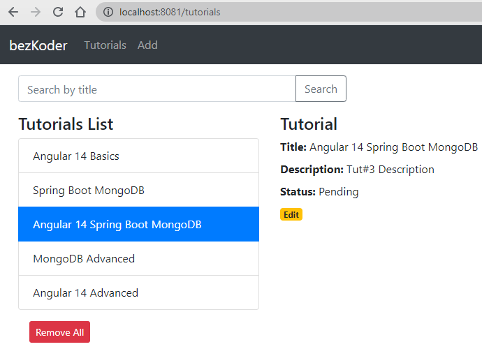

# Spring Boot + Angular 14 + MongoDB example: CRUD App

Full-stack Angular 14 + Spring Boot + MongoDB - Tutorial CRUD Application in that:
- Each Tutorial has id, title, description, published status.
- We can create, retrieve, update, delete Tutorials.
- We can also find Tutorials by title.



For instruction, please visit:
> [Spring Boot + Angular 14 + MongoDB CRUD example](https://www.bezkoder.com/spring-boot-angular-14-mongodb/)

Run both Back-end & Front-end in one place:
> [Integrate Angular with Spring Boot Rest API](https://www.bezkoder.com/integrate-angular-spring-boot/)

More Practice:
> [Angular + Spring Boot: File upload example](https://www.bezkoder.com/angular-14-spring-boot-file-upload/)

> [Angular + Spring Boot: JWT Authentication and Authorization example](https://www.bezkoder.com/angular-14-spring-boot-jwt-auth/)

## Run Spring Boot application
```
cd spring-boot-server
mvn spring-boot:run
```
The Spring Boot Server will export API at port `8081`.

## Run Angular Client
```
cd angular-14-client
npm install
ng serve --port 8081
```
